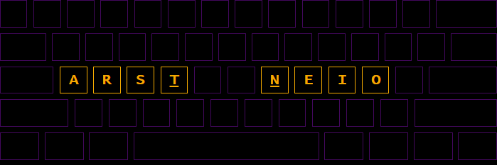

# Level 1

This level tests only words that contain the characters `arst neio`.



## Wordlist

The wordlist counts `285` distinct words:

```
i to a in is on it not or are at as an one no site see so its state into re set store internet states area art rate sites non teen too estate note start series air test san street stores rates east star areas interest enter net stories arts et error sort none near notes seen soon season teens sat sent artist asian inn reason station sea anti tree ie stars est son senior entire Asia artists session int rest sense sets rent ten na attention nation resort stone tests root nor Santa interests saint rose eastern entries errors reasons ones Ontario assistant senate stats iron ne train nations es Toronto assets assist Tennessee rare rise eat seat Ann instant tea trees easier nine interior ratio rain onto tennis stress stations transit noise annotation sister Iran starts rear sessions Antonio raise sir earn resorts insert transition sit treat Nasa si Anne asset sin inner tone stereo taste seats era ran streets sierra inter Sean senator ear tie nearest Ross toe trans ease arena sensor roses tones sons ta orientation assess stones roots titans restoration antenna ion seasons terror intro ent Aaron intent tee entities titten tons restore resistant ins tin terrorist ties rat seniors toner nose territories sees sisters asin reset tri noon tan starter tears oasis retention tire strain trainer inns easter Estonia nano retain rats stat ton trains arise tries intense sensors Reno intention tires retro arrest roster notion soonest ears neo trio terrorists ser tension tier rotation saints tenant tattoo tar retreat estates sie satin tent interstate sans onion sao trainers ant eos raises sorts ate terrain tear nest Stan ratios senators intranet assists seas enters neon notre resist insertion
```

---

[](./lvl2.md)
